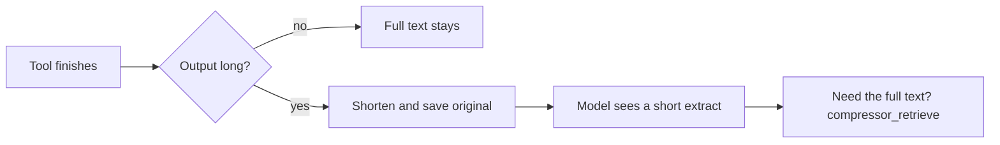

[English](README.md) | [中文](README.zh-CN.md)

# dsh-compressor

*Cut up to 20% of a [DeepSeek Harness](https://github.com/deepseek-ai/deepseek-harness) session — without hurting the model, and without rewriting what already went out.*

[](https://www.npmjs.com/package/dsh-compressor)
[](https://github.com/lifeodyssey/dsh-compressor/actions/workflows/dsh-compressor.yml)

Long tool output is shortened before the next model turn. The original stays on disk. If the model needs it back, it calls `compressor_retrieve`.

## Install

The package is on [npm](https://www.npmjs.com/package/dsh-compressor). Install it with the official DSH command — that command runs **pnpm** inside your profile, so `pnpm` has to be on `PATH`:

```bash
dsh plugin --profile web add dsh-compressor
```

Swap `web` for the profile you actually use, then start DSH as usual.

> [!NOTE]
> `npm i -g dsh-compressor` will not load this as a plugin. DSH only picks up bundles added through `dsh plugin add`.

From a checkout of this repo:

```bash
dsh plugin --profile web add ./plugins/dsh-compressor
```

## How it works



A command that dumps a wall of logs would otherwise sit in every later turn. DSH can already spill huge results to a file and ask the model to read them — that's an extra hop. This plugin shortens the result as soon as the tool returns, before the next turn is assembled. Text already sent to the model is not touched, so the prefix cache stays valid.

If retrieve cannot register, nothing is crushed.

The shortened form looks like this:

```
(a few kept lines)
<<compressor:64-hex>>
```

`<<compressor:…>>` is not a file path. User messages, short results, and DSH's own spill files are left as they are.

Crushers: Headroom's Log / Smart / Text / Search / Diff (`darwin-arm64`, `linux-x64-gnu`).

## Develop

```bash
cd plugins/dsh-compressor
pnpm install
pnpm test
```
