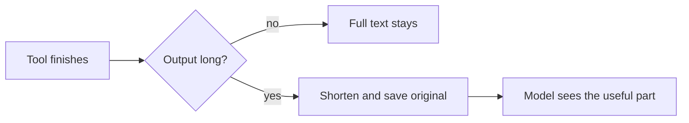

[English](README.md) | [中文](README.zh-CN.md)

# dsh-compressor

[](https://www.npmjs.com/package/dsh-compressor)
[](https://github.com/lifeodyssey/dsh-compressor/actions/workflows/dsh-compressor.yml)

Compresses tool output and cuts up to 20% of context, without affecting the model's context cache or agent performance.

## Install

```bash
dsh plugin --profile web add dsh-compressor
```

## How it works

A tool run leaves a long log / JSON / diff. Only a small part of it is useful. This plugin shortens that output before the next turn, keeps the original on disk, leaves the already-sent prefix alone so the cache stays valid, and gives the agent a tool to pull the full context back.



Compressor code comes from [Headroom](https://github.com/headroomlabs-ai/headroom). Wired in today: Log / Smart / Text / Search / Diff.

- [ ] TODO: migrate the remaining compressors
  - Code-aware (tree-sitter)
  - Kompress (ONNX)

## Develop

```bash
cd plugins/dsh-compressor
pnpm install
pnpm test
```

## Contributing

Plugin code lives in `plugins/dsh-compressor`, crushers in `crates/`. Open PRs on [lifeodyssey/dsh-compressor](https://github.com/lifeodyssey/dsh-compressor), not on upstream Headroom.
