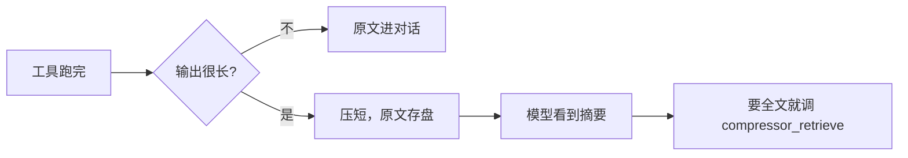

[English](README.md) | [中文](README.zh-CN.md)

# dsh-compressor

*DeepSeek Harness 会话里的上下文，最多能少两成。模型该怎么答还怎么答，已经发出去的前缀也不改。*

[](https://www.npmjs.com/package/dsh-compressor)
[](https://github.com/lifeodyssey/dsh-compressor/actions/workflows/dsh-compressor.yml)

[DeepSeek Harness](https://github.com/deepseek-ai/deepseek-harness) 插件。工具吐出来的大段输出会先压短再给模型；真要全文，模型自己调 `compressor_retrieve`。

## 安装

包在 [npm](https://www.npmjs.com/package/dsh-compressor) 上。进 DSH 用[官方命令](https://github.com/deepseek-ai/deepseek-harness/blob/master/docs/user/develop/basic/publish.md)——它会在 profile 里跑 **pnpm**，所以本机要有 pnpm：

```bash
dsh plugin --profile web add dsh-compressor
```

`web` 换成你实际用的 profile，然后照常启动 DSH。

> [!NOTE]
> 不要 `npm i -g dsh-compressor`。那样装上 DSH 也不会当插件加载，只有 `dsh plugin add` 会写进 profile。

开发这个仓库时可以改成本地目录：

```bash
dsh plugin --profile web add ./plugins/dsh-compressor
```

## 它怎么工作



命令跑完常会留下一大段日志。不管的话，后面每一轮都还带着。DSH 自己也能把特别长的结果存成文件，再让模型去读，多一步。这个插件在结果刚出来、还没写进下一轮对话时就压短。已经发给模型的那截字不会再动，缓存还在。

压不了就不压。

摘要大概是：

```
（留下的几行）
<<compressor:一串哈希>>
```

`<<compressor:…>>` 不是文件路径。用户说的话、短输出、DSH 自己存盘的 spill，都不会动。

压缩器用的是 Headroom 的 Log / Smart / Text / Search / Diff（`darwin-arm64`、`linux-x64-gnu`）。

## 开发

```bash
cd plugins/dsh-compressor
pnpm install
pnpm test
```
