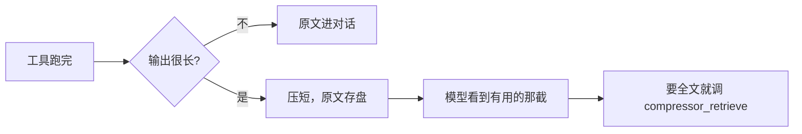

[English](README.md) | [中文](README.zh-CN.md)

# dsh-compressor

[](https://www.npmjs.com/package/dsh-compressor)
[](https://github.com/lifeodyssey/dsh-compressor/actions/workflows/dsh-compressor.yml)

DeepSeek Harness 插件在不影响模型上下文缓存以及 Agent 性能的情况下，压缩工具的输出至多减少 20% 的上下文。

## 安装

```bash
dsh plugin --profile web add dsh-compressor
```

## 它怎么工作

模型跑工具会留下一大段日志，里面只有一小部分有用。插件把长输出压短再给模型，原文留在本机；已经发给模型的前缀不改。真要全文，模型调 `compressor_retrieve`。



压缩器代码来自 [Headroom](https://github.com/headroomlabs-ai/headroom)。现在接上的是 Log / Smart / Text / Search / Diff。

- [ ] TODO：把其余压缩器迁进来（Code-aware、Kompress 等）

## 开发

```bash
cd plugins/dsh-compressor
pnpm install
pnpm test
```

## Contributing

改插件在 `plugins/dsh-compressor`，改压缩器在 `crates/`。PR 开到 [lifeodyssey/dsh-compressor](https://github.com/lifeodyssey/dsh-compressor)，不要开到 Headroom 上游。
